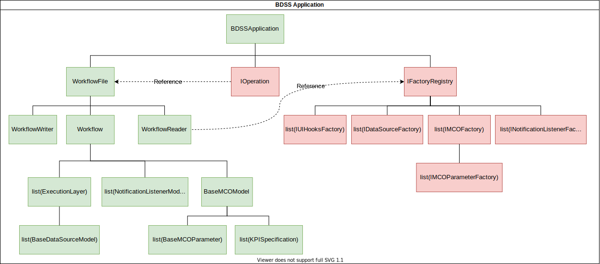

Application
-----------

The main class is the ``BDSSApplication``, an ``envisage.Application`` subclass, which is in
charge of loading the plugins, and also adding the relevant core plugins to make the whole
system run. Specifically it loads:

- The ``FactoryRegistryPlugin``, which is where all external plugins will put
  their classes.
- Depending on the --evaluate switch, a relevant execution plugin:
    - ``OptimizeOperation``: Invokes the MCO.
    - ``EvaluateOperation``: performs a single point evaluation, that is,
      executes the pipeline only once.

Note: the design requiring the ``--evaluate`` switch assumed a "Dakota" model of
execution (external process controlled by Dakota). In the current Enthought Example plugin
we use both the ``--evaluate`` strategy and direct control, where all the
calculation is performed without spawning additional processes other than the
initial ``force_bdss``.

The ``BDSSApplication`` contains the following structure:

At the application level, there are three main attributes of type:

- ``WorkflowFile``: contains the ``Workflow`` object, as well as the ability to
  read, write from file
- ``IOperation``: determines the operation that will be performed by the BDSS
- ``IFactoryRegistry``: contains references to all ``IFactory`` classes that
  are contributed by currently installed plugins. This object is constructed from
  by the ``BDSSApplication``, using the Envisage plugins installed in the local
  environment, but is actually used by ``WorkflowReader`` to instantiate serialized
  ``Workflow`` objects from file.

Upon start up, the ``BDSSApplication`` performs the following process:

Operations
----------

The ``IOperation`` interface defines the requirements for an operation that can be
performed by the BDSS. The ``BaseOperation`` class provides this interface and contains useful
routines that are used to set up both internal and external communication routes.
Currently we have 2 subclasses of this base class: ``EvaluateOperation`` and ``OptimizeOperation``.

The ``OptimizeOperation`` (the default operation performed by the ``force_bdss``) is
designed to work alongside a ``BaseMCO`` subclass, that defines an optimization method
to be performed on a ``Workflow`` instance.

The ``EvaluateOperation`` (invoked by using the ``--evaluate`` flag with the ``force_bdss``
command line application) is designed to work alongside a ``BaseMCOCommunicator`` subclass
that determines how to send and receive MCO parameters and KPIs.

