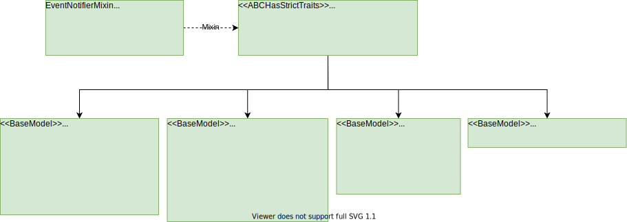
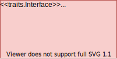

Class Diagrams
==============

Factory Classes
---------------

Factories are used in the BDSS to modularise the code and therefore allow additional components
to be contributed using `plugins <plugin_development>`_.

The ``BaseFactory`` class fulfills an ``IFactory`` interface, and is therefore able to be
contributed and subsequently located by the ``BaseExtensionPlugin`` and ``FactoryRegistryPlugin``
classes respectively

Each individual ``BaseFactory`` subclass also provides an interface that inherits from ``IFactory``.

.. image:: _images/factory_classes_uml.svg

Model Classes
-------------

Each ``BaseModel`` class is designed to act as both a serializable and visual representation of
a ``Workflow`` object. It contains any information that is exposed to the user and, since it
inherits from ``HasTraits``, the UI components are provided by the TraitsUI library.

The ``BaseModel`` classes all share a common API for serialization, event handling and workflow verification:
   - ``notify(BaseDriverEvent):`` Takes an ``BaseDriverEvent`` instance and assigns it to the ``event`` attribute.
   - ``verify():`` Performs a set of checks on the model attributes and returns a list of ``VerifierError``
     instances describing any issues.
   - ``serialize()``: Returns a dictionary object containing basic python values able
     to be written to file as a JSON.

The ``BaseModel.verify`` and ``BaseModel.serialize`` methods are expected to be overridden by any subclass to suit
the needs of the developer, whereas the ``BaseModel.notify`` method is designed to be used as a setter method for
the ``event`` attribute. Further information is available on both `event handling <event_handling>`_
and `verification <verification>`_ pathways in the BDSS.

Runtime Classes
---------------

The factory classes act as creators of ``BaseModel`` instances, as well as other objects
that are only used during an MCO run. The following sections take a closer look at each of these objects
in turn

MCO
~~~

The ``BaseMCOFactory`` fulfills the ``IMCOFactory`` interface. It is able to construct both ``BaseMCO`` and
``BaseMCOModel`` subclasses and also contains references to a list of objects that fulfill the ``IMCOParameterFactory``
interface. Likewise, the ``BaseMCOParameterFactory`` provides this interface and constructs ``BaseMCOParameter`` subclasses.
Consequently, each MCO must declare a set of parameter types that it is able to use.

.. image:: _images/mco_classes_uml.svg

The ``BaseMCOModel`` class provides user input required by a ``BaseMCO`` class during runtime. It also
contains references to, and methods used to broadcast the MCO-related ``BaseDriverEvent`` subclasses:
``MCOStartEvent``, ``MCOProgressEvent`` and ``MCOFinishEvent``. The variables designated as KPIs are represented
by a list of ``KPISpecification`` objects, which also provide scaling instructions in order to convert them into
comparable unit-less values. The ``BaseMCO`` class' only job is to provide the the implementation of any
optimization algorithm that will be performed during the ``BaseMCO.run`` method. This method takes in one argument,
which must fulfill the ``IEvaluator`` interface.

Any object that provides this interface must contain a reference to the corresponding ``BaseMCOModel``, as well as an
implementation of an ``IEvaluator.evaluate`` method which is used to return the state of the system to be optimized
for a given list of input parameters. It is therefore expected that the ``BaseMCO.run`` method will perform some
iteration over ``IEvaluate.evaluate``, passing in possible MCO parameter values and obtaining the corresponding
KPI values as output.

Data Sources
~~~~~~~~~~~~

The ``BaseDataSourceFactory`` fulfills the ``IDataSourceFactory`` interface. It is able to construct both
``BaseDataSource`` and ``BaseDataSourceModel`` subclasses.

.. image:: _images/data_source_classes_uml.svg

The ``BaseDataSourceModel`` class provides user input required by a ``BaseDataSource`` class during runtime.
It is also used in the backend to broadcast any Data Source-related events: ``DataSourceStartEvent`` and
``DataSourceProgressEvent`` and ``DataSourceFinishEvent``.

The ``BaseDataSource`` class has methods that require implementation: ``BaseDataSource.run`` and ``BaseDataSource.slots``
The ``run`` method contains a black box of code that will be performed during evaluation of the workflow. It expects
a reference to the ``BaseDataSourceModel`` as well as a list of ``DataValue`` instances that contain extra parameters
generated during runtime. The ``slots`` method is used to communicate the expected length and
format of both the input and output lists of ``DataValues`` associated with the ``run`` method, mainly so that this
can be displayed in the UI before an MCO run is called.

Notification Listeners
~~~~~~~~~~~~~~~~~~~~~~

The ``BaseNotificationListenerFactory`` fulfills the ``INotificationListenerFactory`` interface. It is able
to construct both ``BaseNotificationListener`` and ``BaseNotificationListenerModel`` subclasses

.. image:: _images/notification_listener_classes_uml.svg

The ``BaseNotificationListenerModel`` class provides user input required by a ``BaseNotificationListener``
class during runtime.
