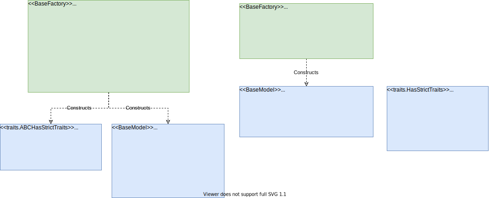

Class Diagrams
==============

Factory Classes
---------------

All ``BaseFactory`` subclasses fulfill an ``IFactory`` interface, and are therefore able to be
contributed and subsequently located by the ``BaseExtensionPlugin`` and ``FactoryRegistryPlugin``
classes respectively

.. image:: _images/i_factory_classes.svg

The individual factories also posses interfaces that inherit from ``IFactory``

Model Classes
-------------

Each ``BaseModel`` class is designed to act as both a serializable and visual representation of
a ``Workflow`` object. It contains any information that is exposed to the user and, since it
inherits from ``HasTraits``, the UI components are provided by the TraitsUI library.

The ``BaseModel`` classes all share a common API for serialization, event handling and workflow verification:
   - ``notify(BaseDriverEvent):`` Takes an ``BaseDriverEvent`` instance and assigns it to the ``event`` attribute.
   - ``verify():`` Performs a set of checks on the model attributes and returns a list of ``VerifierError``
     instances describing any issues.
   - ``serialize()``: Returns a dictionary object containing basic python values able
     to be written to file as a JSON.

The ``BaseModel.verify`` and ``BaseModel.serialize`` methods are expected to be overridden by any subclass to suit
the needs of the developer, whereas the ``BaseModel.notify`` method is designed to be used as a setter method for
``BaseModel.event``. Further information is available on both `event handling <event_handling.rst>`_
and `verification <verification.rst>`_ pathways in the BDSS.

BDSS Runtime Classes
--------------------

The following sections take a closer look at how these classes are implemented in each factor of
the BDSS: MCO, Data

MCO
~~~

The ``BaseMCOFactory`` fulfills the ``IMCOFactory`` interface. It is able to construct both ``BaseMCO`` and
``BaseMCOModel`` subclasses and also contains references to a list of objects that fulfill the
``IMCOParameterFactory`` interface.

Likewise, the ``BaseMCOParameterFactory`` fulfills the ``IMCOParameterFactory`` interface and constructs
``BaseMCOParameter`` subclasses. Consequently, each MCO must declare a set of parameter types that it is
able to use.

The ``BaseMCOModel`` class provides user input required by a ``BaseMCO`` class during runtime. It also
contains references to, and methods used to broadcast the MCO-related ``BaseDriverEvent`` subclasses:
``MCOStartEvent``, ``MCOProgressEvent`` and ``MCOFinishEvent``. These are therefore accessible during the
``BaseMCO.run`` method and can be called by any subclass implementation.

.. image:: _images/base_mco_run.svg

Data Sources
~~~~~~~~~~~~

The ``BaseDataSourceFactory`` fulfills the ``IDataSourceFactory`` interface. It is able to construct both
``BaseDataSource`` and ``BaseDataSourceModel`` subclasses

.. image:: _images/data_source_classes_uml.svg

The ``BaseDataSourceModel`` class provides user input required by a ``BaseDataSource`` class during runtime.
It is also used in the backend to broadcast events signalling the beginning and end of a ``BaseDataSource.run``
method: ``DataSourceStartEvent`` and ``DataSourceFinishEvent``. By doing so, we are able to pause and stop
and MCO run between each Data Source execution.

.. image:: _images/base_data_source_run.svg

Notification Listeners
~~~~~~~~~~~~~~~~~~~~~~

The ``BaseNotificationListenerFactory`` fulfills the ``INotificationListenerFactory`` interface. It is able
to construct both ``BaseNotificationListener`` and ``BaseNotificationListenerModel`` subclasses

.. image:: _images/notification_listener_classes_uml.svg

The ``BaseNotificationListenerModel`` class provides user input required by a ``BaseNotificationListener``
class during runtime.

.. image:: _images/base_notification_listener_initiate.svg