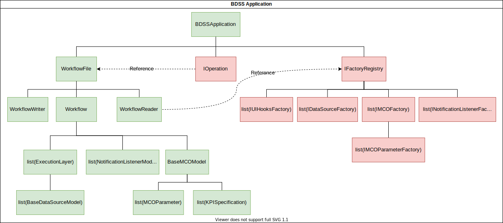
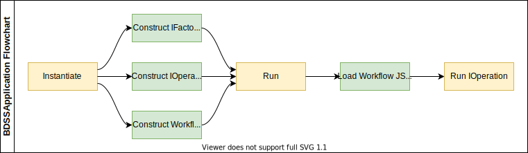
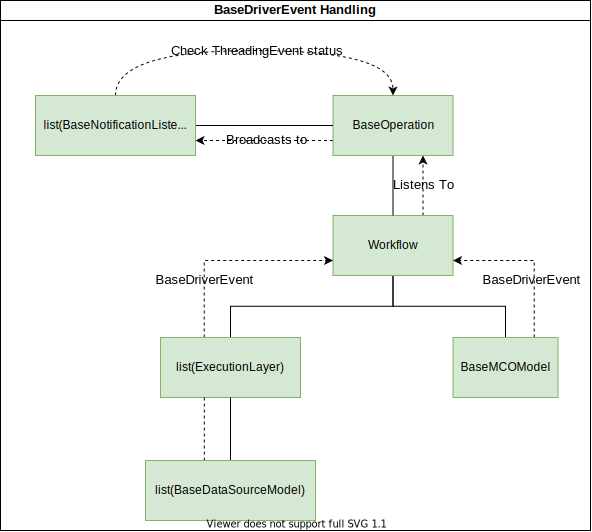
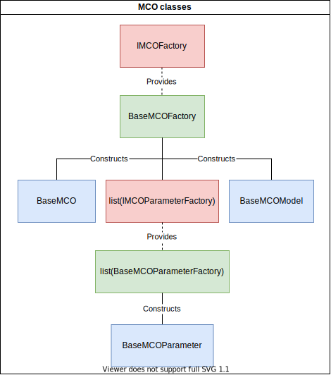
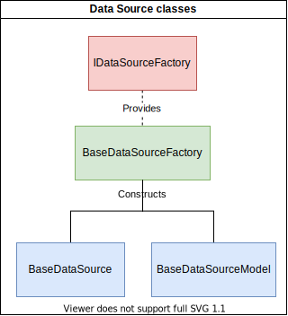
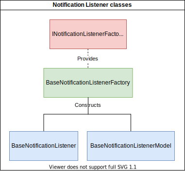
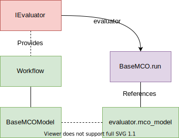
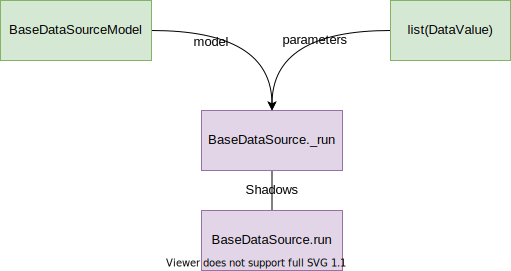
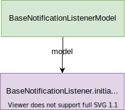

FORCE BDSS Design
=================

The BDSS is an Envisage/Task application. it uses tasks to manage the plugin
system, with stevedore to manage the additions.

The main class is ``BDSSApplication``, which is in charge of loading the plugins,
and also adding the relevant core plugins to make the whole system run.
Specifically it loads:

- The ``FactoryRegistryPlugin``, which is where all external plugins will put
  their classes.
- Depending on the --evaluate switch, a relevant execution plugin:
    - ``OptimizeOperation``: Invokes the MCO.
    - ``EvaluateOperation``: performs a single point evaluation, that is,
      executes the pipeline only once.

Note: the design requiring the ``--evaluate`` switch assumed a "Dakota" model of
execution (external process controlled by Dakota). In the current Enthought Example plugin
we use both the ``--evaluate`` strategy and direct control, where all the
calculation is performed without spawning additional processes other than the
initial ``force_bdss``.

Application
-----------

The ``BDSSApplication`` is an ``envisage.Application`` subclass,
which contains the following structure:

At the ``BDSSApplication`` level, there are three main attributes of type:

- ``WorkflowFile``: contains the ``Workflow`` object, as well as the ability to
  read, write from file
- ``IOperation``: determines the operation that will be performed by the BDSS
- ``IFactoryRegistry``: contains references to all ``IFactory`` classes that
  are contributed by currently installed plugins. This object is constructed from
  by the ``BDSSApplication``, using the Envisage plugins installed in the local
  environment, but is actually used by ``WorkflowReader`` to instantiate serialised
  ``Workflow`` objects from file.

Upon start up, the ``BDSSApplication`` performs the following process

Event Handling
--------------

The ``BaseDriverEvent`` class is the main object used to relay messages internally between
components of the ``BDSSApplication``. It can also be serialized in order to be passed between
external programs (i.e. the ``force_wfmanager``) as a JSON.

Any events that are created during runtime are propagated through the ``Workflow`` object
hierarchy, up to the ``IOperation`` class that is being performed by the ``BDSSApplication``,
before finally being broadcast to all ``BaseNotificationListener`` classes present. Consequently,
the ``BaseModel`` class contains an ``event`` attribute, as well as a ``notify`` method that is used to
set it. Listeners can then detect changes in any ``BaseModel.event`` subclass, and
process the new event accordingly.

Any actions that are required to be performed upon notification of a specific ``BaseDriverEvent``
subclass are handled by the ``BaseNotificationListener.deliver`` method.

In this way, we can also use ``BaseDriverEvents`` to control the progress of an MCO run,
since after every broadcast, the ``OptimizeOperation`` checks its run time status to see whether
the event has triggered a MCO 'pause' or 'stop' signal.

Factory Classes
---------------

All ``BaseFactory`` subclasses fulfill an ``IFactory`` interface, and are therefore able to be
contributed and subsequently located by the ``BaseExtensionPlugin`` and ``FactoryRegistryPlugin``
classes respectively

MCO
~~~

The ``BaseMCOFactory`` fulfills the ``IMCOFactory`` interface. It is able to construct both ``BaseMCO`` and
``BaseMCOModel`` subclasses and also contains references to a list of objects that fulfill the
``IMCOParameterFactory`` interface.

Likewise, the ``BaseMCOParameterFactory`` fulfills the ``IMCOParameterFactory`` interface and constructs
``BaseMCOParameter`` subclasses. Consequently, each MCO must declare a set of parameter types that it is
able to use.

Data Sources
~~~~~~~~~~~~

The ``BaseDataSourceFactory`` fulfills the ``IDataSourceFactory`` interface. It is able to construct both
``BaseDataSource`` and ``BaseDataSourceModel`` subclasses

Notification Listeners
~~~~~~~~~~~~~~~~~~~~~~

The ``BaseNotificationListenerFactory`` fulfills the ``INotificationListenerFactory`` interface. It is able
to construct both ``BaseNotificationListener`` and ``BaseNotificationListenerModel`` subclasses

Model Classes
-------------

Each ``BaseModel`` class is designed to act as both a serializable and visual representation of
a ``Workflow`` object. It contains any information that is exposed to the user and, since it
inherits from ``HasTraits``, the UI components are provided by the TraitsUI library.

MCO
~~~

The ``BaseMCOModel`` class provides user input required by a ``BaseMCO`` class during runtime. It also
contains references to, and methods used to broadcast the MCO-related ``BaseDriverEvent`` subclasses:
``MCOStartEvent``, ``MCOProgressEvent`` and ``MCOFinishEvent``. These are therefore accessible during the
``BaseMCO.run`` method and can be called by any subclass implementation.

Data Sources
~~~~~~~~~~~~

The ``BaseDataSourceModel`` class provides user input required by a ``BaseDataSource`` class during runtime.
It is also used in the backend to broadcast events signalling the beginning and end of a ``BaseDataSource.run``
method: ``DataSourceStartEvent`` and ``DataSourceFinishEvent``. By doing so, we are able to pause and stop
and MCO run between each Data Source execution.

Notification Listeners
~~~~~~~~~~~~~~~~~~~~~~

The ``BaseNotificationListenerModel`` class provides user input required by a ``BaseNotificationListener``
class during runtime.

Package Structure
-----------------

As well as a command line program, the BDSS also comes with a ``force_bdss`` package containing
objects required by plugin developers. These should be publicly accessed through the ``force_bdss.api``
module, but a brief explanation of the internal structure is provided below.

The ``data_sources``, ``mco``, ``notification_listeners`` and ``ui_hooks`` packages, and
the ``base_extension_plugin`` class, contain all the base classes that plugin developers need
to use in order to write a plugin. They have been coded to be as error tolerant
as possible, and deliver robust error messages as much as possible.

The ``io`` package contains the reader and writer for the model. It simply
serializes the model objects and dumps them to JSON, or vice-versa. Note that
the reader requires the factory registry, because you can't load entities
from the file if you don't have the appropriate plugin, as only the plugin
knows the model structure and can therefore take the JSON content and apply
it to the model object.

The ``core_plugins`` contains fundamental plugins that are considered part of a
"standard library", providing common data sources, MCOs and other relevant objects.

Finally, ``core`` contains:

- base classes for a few entities that are reused for the plugins.
- the ``DataValue`` entity. This is the "exchange entity" between data sources.
  It is a value that also contains the type, the accuracy, and so on. It can
  refer to anything: a float, an array, a string, etc.
- ``Workflow`` model object, representing the entire state of the BDSS.
- ``input/output_slot_info`` contain the ``_bound_`` information for slots. A
  ``DataSource`` provides slots (see slot module) but these are not bound to a
  specific "variable name". The ``SlotInfo`` classes provide this binding.
- ``execution_layer`` contains the ``ExecutionLayer`` class, which provides the actual machinery
  that runs the pipeline.
- ``verifier`` contains a verification function that checks if the workflow can
  run or has errors.

Workflow JSON Files
-------------------
A ``Workflow`` object can be instantiated from an appropriately formatted workflow JSON file.
Typically the structure of this JSON represents a serialised version of each object contained within
the ``Workflow``. Currently the ``WorkflowReader`` supports two file versions: 1 and 1.1.
There are only minor differences between both versions:

1. ``Workflow.mco_model`` attribute data stored under ``mco`` key in version 1 vs ``mco_model`` key in 1.1
2. ``Workflow.execution_layers`` attribute data represented as a list of lists in version 1 vs
   a list of dictionaries in version 1.1. In version 1, each element in the outer list implicitly represents
   an execution layer, whilst each element in the the inner list represents the serialised status of a
   ``DataSourceModel`` instance. In version 1.1, we explicitly include the status of each ``ExecutionLayer``
   instance in the outer list, and therefore each dictionary element is also expected to contain a
   ``data_sources`` key with a list of ``DataSourceModel`` statuses.

The ``WorkflowWriter`` will produce JSON files that conform to the latest available version (currently 1.1)
by default.

Future directions
-----------------

The future design will probably need to address the following:

- Check if the ``--evaluate`` strategy and design is still relevant. More MCOs are
  needed for reasonable conclusions.
- IWM is going to provide a strict description of types (``osp-core``, previously
  known as ``simphony``). Currently, all type entries in the e.g. slots are simple
  strings as a workaround. This is supposed to change once IWM provides a
  comprehensive set of types.
- The project is now at a stage where plugins can be developed, and real
  evaluations can be performed. We can solve the current toy cases, but real
  cases and UI requirements may promote the need for additional requirements.
