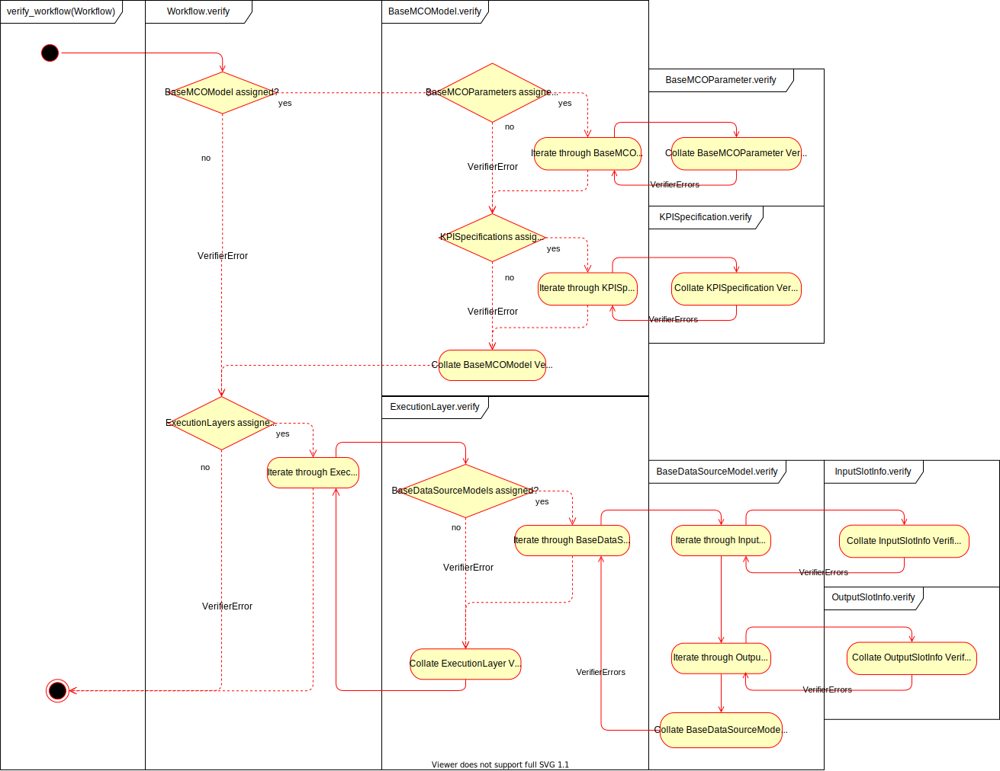

Verification
------------

Any ``Workflow`` instance can be verified by invoking the ``verify_workflow`` function.
This returns a list of ``VerifierError`` instances, generated by iterating through the
``Workflow`` hierarchy and calling each bound ``verify`` method in turn.

In the ``BDSSApplication``, this function is called during the beginning of both ``OptimizeOperation.run``
and ``EvaluateOperation.run`` methods. If any ``VerifierError`` instances are returned, then
an ``Exception`` is raised and the program will terminate. Additionally, since the ``Workflow``
can be verified prior to the ``force_bdss`` runtime, the ``force_wfmanager`` GUI is able to report
any errors back to the user as the ``Workflow`` is being constructed.