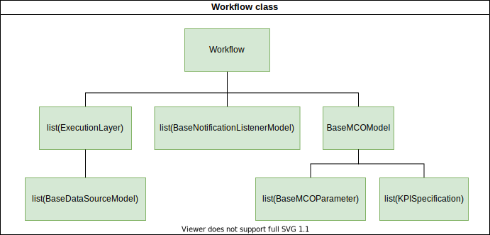

Workflow
========

The ``Workflow`` contains a full description of the system to be optimised, the optimisation
procedure and any listener objects that are expected to react on events that are
created during runtime.

Workflow Specification
----------------------

The "Workflow" object of the application needs to contain a representation of three entities:

- Multi Criteria Optimizer (MCO)
- Data Sources
- Notification Listeners

Additionally, messages can be sent and received between the CLI ``force_bdss`` application
and the ``force_wfmanager`` GUI via a subset of notification listener, known as a
'UI Hook'.

There are a few core assumptions about each of these entities:

- The MCO provides numerical values and injects them into a pipeline
  made of multiple layers. Each layer is composed of multiple Data Sources.
  The MCO can execute this pipeline directly, or indirectly by invoking
  the ``force_bdss`` with the option ``--evaluate``. This invocation will produce,
  given a vector in the input space, a vector in the output space.
- The Data Sources are entities that are arranged in layers. Each Data Source has
  inputs and outputs, called slots. These slots may depend on the configuration
  options of the specific data source. The pipeline is created by binding
  data sources outputs on the layers above with the data sources inputs of a
  given layer. Each output can be designated as a KPI and thus be transmitted
  back to the MCO for optimization.
- A Notification Listener listens to the state of the MCO (i.e. Started/New step
  of the computation/Finished) and can perform tasks accordingly.
  For example, it could connect to a remote database which is filled with the
  MCO results during the computation (e.g. the GUI ``force_wfmanager``
  has a notification listener in order to fill the result table).
- UI Hooks permit to define additional operations which will be executed
  at specific moments in the UI lifetime (before and after execution of the
  BDSS, before saving the workflow). Those operations won't be executed by the
  command line interface of the BDSS.

``Workflow`` Class
------------------

The specifications above can be performed by the ``Workflow`` class, a concrete
implementation of a pipeline for the BDSS:

-  The ``Workflow.mco_model`` attribute refers to a ``BaseMCOModel`` instance that
   defines user-inputted parameters for the MCO. It contains a list of ``BaseMCOParameter``
   instances that define the search space, as well as a list of ``KPISpecification`` instances
   referring to variables that will be optimised. It also defined the types of
   ``MCOStartEvent``, ``MCOProgressEvent`` and ``MCOFinishEvent`` classes that will
   be emitted during the MCO run time.
-  The ``Workflow.execution_layers`` attribute contains a list of ``ExecutionLayer``
   instances that represent each Data Source layer. Within each element, the
   ``ExecutionLayer.data_sources`` attribute contains a list of ``BaseDataSourceModel``
   instances that define the input and output slots for each Data Source.
   The ``ExecutionLayer.execute`` method can be called to calculate all ``DataValue``
   objects that are generated by that layer.
-  The ``Workflow.notification_listeners`` attribute contains a list of
   ``BaseNotificationListener`` instances that define user-inputted parameters for each
   notification listener that will be active during the MCO run.

During an Force BDSS run, the ``Workflow`` object is used to initialise the MCO and also
perform each calculation of the system state for a given set of input parameter values.
This is carried out by the following steps:

#. Pass the ``Workflow`` instance into the ``BaseMCO.run`` method as the
   ``evaluator`` argument.
#. For every iteration in the MCO method, ``Workflow.evaluate`` method can then be
   invoked for a list of values referring to the state of each ``BaseMCOParameter``.
   The return values represent the corresponding state of each ``KPISpecification``.
#. Both parameter and KPI values can then be broadcast to any ``BaseNotificationListener``
   instances active using the ``Workflow.mco_model.notify_progress_event`` method.
#. Iterate steps 2 and 3 until all evaluations have been performed and the MCO has finished.

Workflow JSON Files
-------------------
A ``Workflow`` object can be instantiated from an appropriately formatted workflow JSON file.
Typically the structure of this JSON represents a serialised version of each object contained within
the ``Workflow``. Currently the ``WorkflowReader`` supports two file versions: 1 and 1.1.
There are only minor differences between both versions:

1. ``Workflow.mco_model`` attribute data stored under ``mco`` key in version 1 vs ``mco_model`` key in 1.1
2. ``Workflow.execution_layers`` attribute data represented as a list of lists in version 1 vs
   a list of dictionaries in version 1.1. In version 1, each element in the outer list implicitly represents
   an execution layer, whilst each element in the the inner list represents the serialised status of a
   ``DataSourceModel`` instance. In version 1.1, we explicitly include the status of each ``ExecutionLayer``
   instance in the outer list, and therefore each dictionary element is also expected to contain a
   ``data_sources`` key with a list of ``DataSourceModel`` statuses.

The ``WorkflowWriter`` will produce JSON files that conform to the latest available version (currently 1.1)
by default.